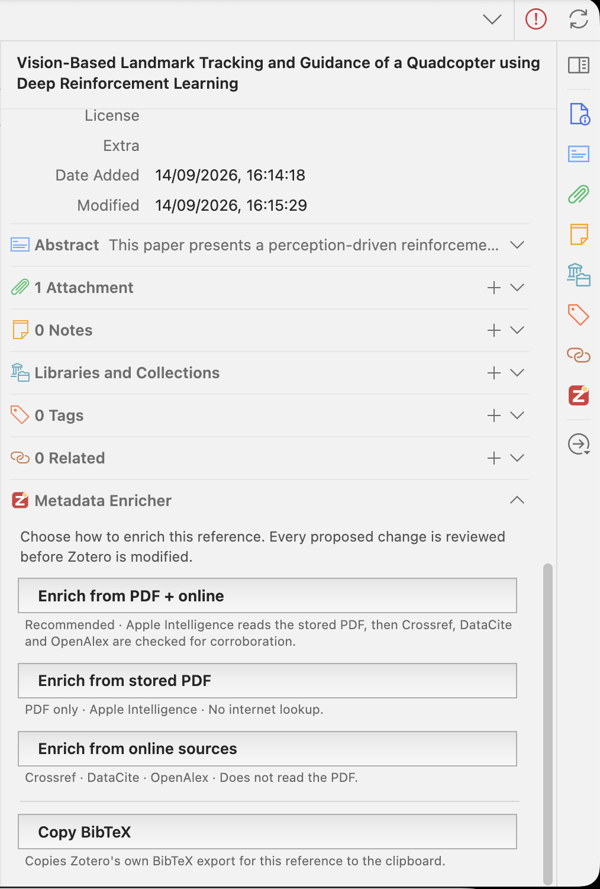
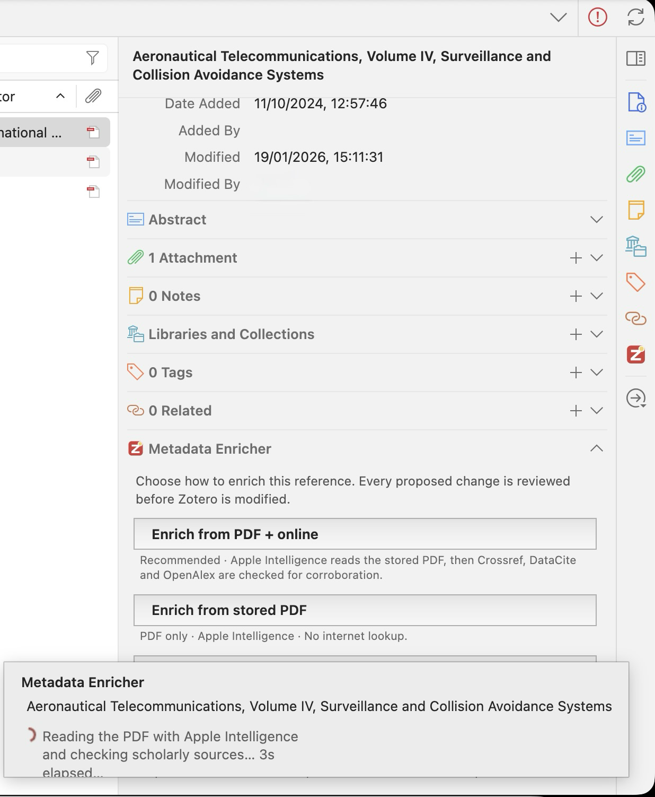
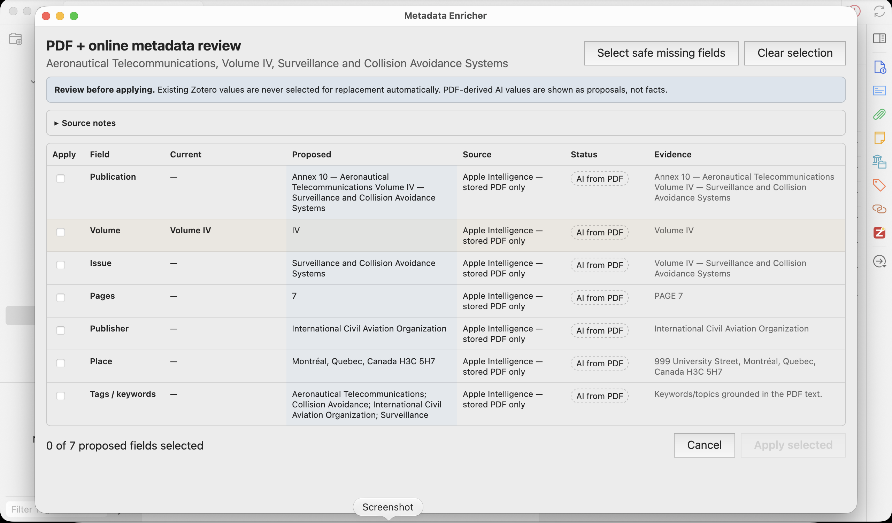
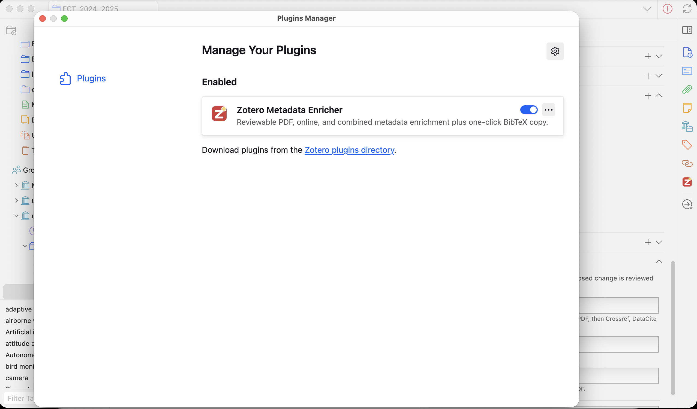
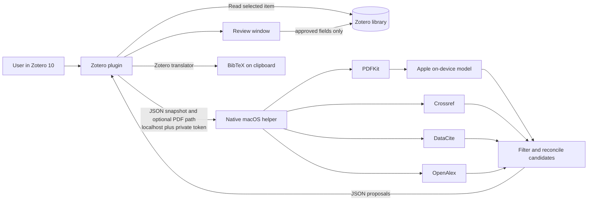
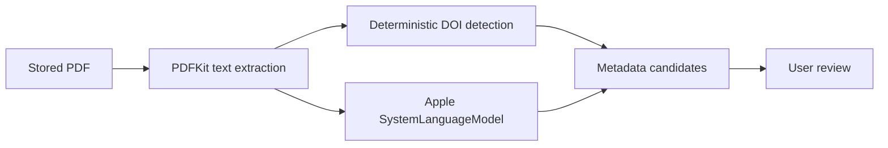
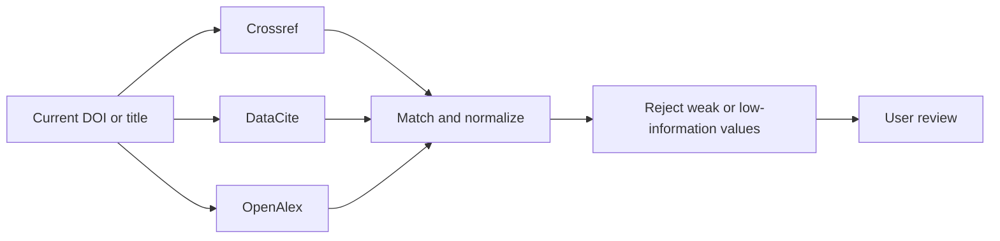

# Zotero Metadata Enricher

<p align="center">
  
</p>

[](https://www.zotero.org/support/dev/zotero_10_for_developers)
[](https://developer.apple.com/documentation/foundationmodels)
[](LICENSE)

**Reviewable metadata enrichment for Zotero 10 on macOS.** Read a stored PDF with Apple Intelligence, check scholarly databases, combine both evidence paths, or copy BibTeX—without silently overwriting metadata.

> [!NOTE]
> **At a glance:** select a Zotero reference, click one of four actions, inspect the proposed values, and approve only what should be saved. PDF analysis stays local. Online mode sends DOI/title queries—not the PDF—to Crossref, DataCite, and OpenAlex.

## Choose an action

| Zotero action | Best for | What happens |
|---|---|---|
| **Enrich from PDF + online** | Best overall evidence | Reads the local PDF, queries three scholarly services, and marks exact cross-source agreement as **Corroborated** |
| **Enrich from stored PDF** | Offline or hard-to-find records | PDFKit extracts text; Apple's on-device Foundation Model proposes document-grounded metadata |
| **Enrich from online sources** | Checking DOI/title records | Queries Crossref, DataCite, and OpenAlex without opening or uploading the PDF |
| **Copy BibTeX** | Fast citation export | Uses Zotero's own BibTeX translator and copies the result to the clipboard |

Every enrichment action opens a review window. Existing non-empty fields are not preselected for replacement. Conflicting alternatives remain separate, and the plugin allows at most one accepted value per Zotero field.

## Privacy in one table

| Mode | Apple Intelligence | Internet lookup | PDF uploaded | Can modify Zotero |
|---|---:|---:|---:|---:|
| Copy BibTeX | No | No | No | No |
| Stored PDF | On-device, when available | No | No | Only after review |
| Online sources | No | Yes: DOI/title queries | No | Only after review |
| PDF + online | On-device PDF analysis | Yes: DOI/title queries | No | Only after review |

The native helper returns proposals only. It never writes `zotero.sqlite` or Zotero attachment storage. Approved changes are written by the plugin through Zotero APIs.

## Requirements

- **Zotero:** 10.0.x
- **Operating system:** macOS 26 or later
- **PDF AI analysis:** a Mac, region, language, and system configuration supported by Apple Intelligence
- **Source installation:** Xcode or compatible Swift 6.2 toolchain, plus Node.js, `jq`, `zip`, `unzip`, and `curl`

Version **0.2.5**, build **7**, is currently a source/developer release. The helper is built locally and ad-hoc signed; it is not yet distributed as a Developer ID-signed and notarized public binary.

## See it in Zotero 10

The plugin lives in Zotero's item pane, so its four actions are available beside the reference you are already reviewing.



While enrichment is running, Zotero shows which evidence paths are being checked and the elapsed time.



Enrichment results open in a separate review window. It shows the current value, each proposed value, its source, status, and supporting evidence. Nothing is written until you select proposals and click **Apply selected**.



After installation, **Zotero Metadata Enricher** appears and can be enabled under **Tools → Plugins**.

<details>
<summary>Show the installed plugin</summary>



</details>

## Install in five minutes

```bash
git clone https://github.com/conradoguimaraes/ZoteroAI.git
cd ZoteroAI
chmod +x scripts/*.sh
./scripts/install-helper.sh
./scripts/build-plugin.sh
```

The commands install the local helper at:

```text
~/Applications/Zotero Metadata Helper.app
```

and build the plugin at:

```text
dist/zotero-metadata-enricher-0.2.5.xpi
```

Then:

1. Open Zotero **Tools → Plugins**.
2. Open the gear menu and choose **Install Plugin From File…**.
3. Select the generated `.xpi`.
4. Restart Zotero if requested.

### Upgrading from the earlier private build

The public package uses the permanent add-on ID:

```text
zotero-metadata-enricher@conradoguimaraes.github.io
```

Earlier private builds used a different local ID. Remove the old Metadata Enricher entry from **Tools → Plugins**, restart Zotero, and install the newly built XPI once. This does not remove or alter Zotero library data. The native helper can stay installed.

### After restarting the Mac

Normally, just open Zotero and use the actions. The plugin attempts to launch the installed helper on demand. **Copy BibTeX** does not use the helper at all.

If automatic launch fails:

```bash
open "$HOME/Applications/Zotero Metadata Helper.app"
```

## First safe test

1. Select a regular bibliographic item—the parent reference, not its PDF attachment.
2. Right-click it and test **Copy BibTeX**.
3. Choose a disposable or duplicate reference with a stored PDF.
4. Run **Enrich from stored PDF**.
5. Review the table and accept one clearly correct missing value.
6. Confirm the result in Zotero before testing online or collection enrichment.

The same actions appear in the **Metadata Enricher** section of Zotero's item pane. Collection actions appear when exactly one collection is selected; v0.2.5 processes its regular items sequentially and asks for review item by item.

## Understand the review window

| Column | Meaning |
|---|---|
| **Apply** | Whether the proposal will be written |
| **Field** | Target Zotero field, creators, or tags |
| **Current** | Value already stored in Zotero |
| **Proposed** | Candidate returned by the helper |
| **Source** | PDF extraction, Apple Intelligence, or online provider(s) |
| **Status** | Strength and type of evidence |
| **Evidence** | Supporting excerpt or matching information when available |

Status labels are deliberately specific:

| Status | Meaning |
|---|---|
| **Verified** | An online record matched the item's DOI |
| **Corroborated** | Multiple independent paths returned the same normalized value |
| **PDF extracted** | Deterministic extraction from PDF text, currently used for DOI |
| **AI from PDF** | On-device model proposal grounded in the PDF excerpt; it is not a verified fact |
| **Online** | Title-based or single-source result without exact DOI verification |

When applying changes, tags are merged. Accepting an author proposal replaces author creators but preserves editors, translators, and other non-author roles.

## How it works



### Plugin → helper

The plugin sends a JSON snapshot over `127.0.0.1:43119` containing:

```text
request ID
item ID, key, library ID, and item type
current scalar metadata fields
creators and creator roles
tags
optional local PDF path
```

Enrichment endpoints require a random token stored with owner-only permissions at:

```text
~/Library/Application Support/Zotero Metadata Enricher/token
```

The token is not an API key and is never sent to Crossref, DataCite, or OpenAlex. It authenticates communication between the Zotero plugin and the helper on the same Mac.

### Stored-PDF path



Apple Intelligence receives a bounded excerpt and is instructed to use the PDF as evidence, ignore instructions embedded in it, avoid outside knowledge, and omit uncertain fields. Version 0.2.5 does not perform OCR; scanned image-only PDFs may yield no useful text.

### Online path



The helper prefers DOI lookup. If DOI lookup is unavailable or inconsistent with the current title, it falls back to title search. Weak title matches, empty values, placeholders such as `Unknown` or `Unpublished`, duplicates, and less-specific dates are discarded before review.

OpenAlex contributes bibliographic corroboration but deliberately does not propose author replacement in v0.2.5.

## What can be proposed

Depending on item type and available evidence:

- title and authors;
- DOI, ISBN, and ISSN;
- publication, conference, or proceedings title;
- date, volume, issue, and pages;
- publisher and place;
- URL and language;
- abstract;
- tags or keywords.

Zotero decides whether a scalar field is valid for the selected item type. Unsupported proposals are skipped rather than forced into the record.

## Known limitations

- macOS-only native helper;
- Zotero 10.0.x only;
- no OCR for image-only PDFs;
- no online-response cache or provider-specific retry/backoff policy yet;
- collection enrichment is sequential and interactive;
- helper binaries built from source are not notarized;
- automatic plugin updates require a published and tested `updates.json` release asset.

## Quick troubleshooting

Check the helper:

```bash
curl --silent --show-error --fail http://127.0.0.1:43119/health
```

Expected version/build:

```json
{"build":7,"service":"Zotero Metadata Helper","version":"0.2.5"}
```

Run full diagnostics:

```bash
./scripts/diagnose-helper.sh
```

Common causes:

- **No plugin controls:** confirm Zotero 10.0.x, enable the plugin, restart Zotero, then inspect **Tools → Developer → Error Console** for `[ZME]` messages.
- **No PDF proposals:** confirm the attachment is stored locally, readable, and contains selectable text.
- **Apple Intelligence unavailable:** confirm the Mac and system configuration support it and that the model is ready.
- **No online match:** verify the DOI/title and retry; provider coverage and availability vary.
- **Port already used:** run `lsof -nP -iTCP:43119 -sTCP:LISTEN`; only `ZoteroMetadataHelper` should own it.

Never post the helper token, a private PDF, a Zotero database, or an uncropped personal-library screenshot in a bug report.

## Repository layout

```text
.
├── helper/     Native Swift helper, data model, provider adapters, and tests
├── plugin/     Zotero bootstrap plugin, review UI, icons, and localization
├── scripts/    Build, install, diagnose, verify, package, and uninstall tools
├── docs/       Detailed installation, usage, architecture, privacy, and development notes
├── VERSION
├── BUILD
└── Makefile
```

The root README is intended to be sufficient for evaluation and first use. Detailed references remain available for maintainers and troubleshooting:

- [Installation details](docs/INSTALL.md)
- [Complete usage guide](docs/USAGE.md)
- [Architecture and data model](docs/ARCHITECTURE.md)
- [Privacy](docs/PRIVACY.md)
- [Troubleshooting](docs/TROUBLESHOOTING.md)
- [Development and releases](docs/DEVELOPMENT.md)
- [Contributing](CONTRIBUTING.md)
- [Security policy](SECURITY.md)

## Verify the source

```bash
./scripts/verify.sh
```

This checks JavaScript syntax, XHTML structure, manifest/version consistency, regression invariants, Swift tests/build, and XPI contents. Runtime UI behavior still requires testing in Zotero on a supported Mac.

## License and affiliation

Original code is licensed under the [MIT License](LICENSE). This is an independent project and is not affiliated with or endorsed by Zotero or Digital Scholar. Crossref, DataCite, OpenAlex, Apple, and Zotero remain governed by their respective owners and terms. See [NOTICE.md](NOTICE.md).
