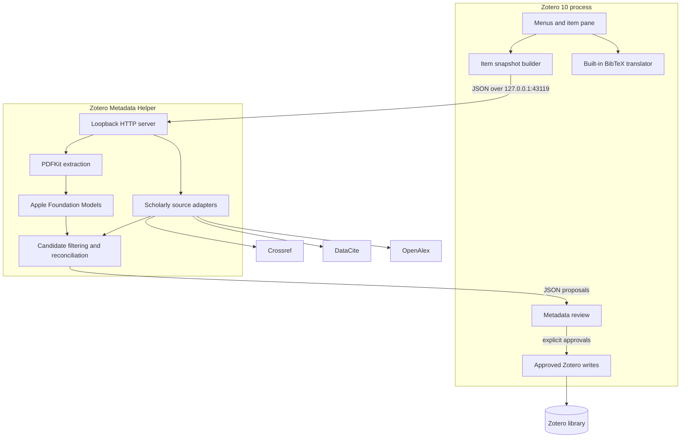
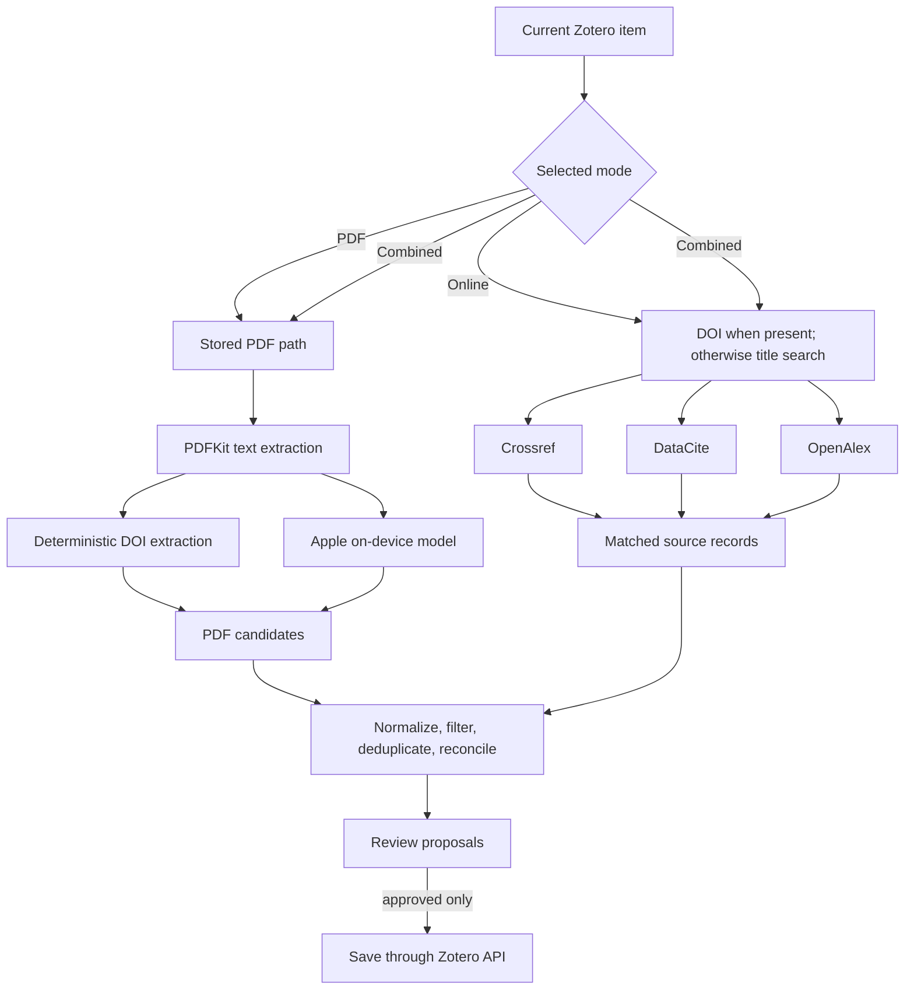

# Architecture

## Components and trust boundaries

Zotero Metadata Enricher has two runtime components:

1. The Zotero 10 plugin owns Zotero selection, menus, the item-pane controls, review UI, approved writes, and BibTeX export.
2. The native macOS helper owns PDFKit extraction, Apple Foundation Models inference, and requests to scholarly metadata providers.



The helper has no code path that writes Zotero's database. The plugin writes through Zotero APIs only after review.

## Runtime protocol

The helper binds to `127.0.0.1:43119`. `GET /health` is public on loopback. Every enrichment request must include the value of the local token in the `X-ZME-Token` header.

The token is generated with secure random bytes and stored at:

```text
~/Library/Application Support/Zotero Metadata Enricher/token
```

The file is created with POSIX mode `0600`. The request body limit is 2 MB. Responses use JSON and `Cache-Control: no-store`.

| Method and path | Purpose | Typical timeout in the plugin |
|---|---|---:|
| `GET /health` | Helper version, build, and Apple Intelligence availability | Short health check |
| `POST /v1/pdf-enrich` | Local PDF extraction and Apple Intelligence analysis | 300 seconds |
| `POST /v1/online-enrich` | Crossref, DataCite, and OpenAlex lookup | 60 seconds |
| `POST /v1/combined-enrich` | PDF and online paths followed by reconciliation | 300 seconds |

The plugin attempts to launch `~/Applications/Zotero Metadata Helper.app` and retry when the helper is genuinely unreachable.

## Request data model

The plugin converts the selected Zotero item into this logical structure:

```text
EnrichmentRequest
├── requestID: string
├── item: ItemSnapshot
│   ├── itemID: integer
│   ├── itemKey: string
│   ├── libraryID: integer
│   ├── itemType: string
│   ├── fields: map<string, string>
│   ├── creators: CreatorSnapshot[]
│   │   ├── firstName: string
│   │   ├── lastName: string
│   │   └── creatorType: string
│   └── tags: string[]
└── pdfPath: string or null
```

`fields` contains scalar values returned by Zotero's item JSON, excluding structural keys such as creators, tags, collections, and relations. The local PDF path is included only for PDF or combined enrichment.

## Response data model

```text
EnrichmentResponse
├── requestID: string
├── candidates: MetadataCandidate[]
│   ├── id: string
│   ├── field: Zotero field name
│   ├── value: display/scalar value
│   ├── structuredValue: optional JSON for creators or tags
│   ├── source: string
│   ├── status: verified | corroborated | pdfExtracted | aiFromPDF | online
│   ├── evidence: optional string
│   └── confidence: number
└── notes: string[]
```

Candidate fields are ordered as follows when present: title, creators, DOI, publication or conference title, date, volume, issue, pages, publisher, place, ISSN, ISBN, URL, language, abstract, and tags.

## Evidence paths



For Crossref and DataCite, an exact DOI is the strongest match. If DOI lookup fails or is unavailable, the helper searches by title and rejects records below its title-similarity threshold. OpenAlex is used for bibliographic corroboration and deliberately does not propose author replacement in v0.2.5.

## Proposal filtering and write rules

Before review, the helper rejects:

- empty values and placeholders such as `Unknown`, `N/A`, `Unpublished`, and `Untitled`;
- values identical to the current Zotero value after normalization;
- less-specific dates that would replace a more-specific existing date, such as `2020` over `2020-08-31`.

In combined mode, a normalized value present in both a PDF candidate and an online candidate is marked `corroborated`. Conflicting values remain separate. The review UI permits at most one accepted value for each Zotero field.

When saving:

- scalar fields are validated against the selected Zotero item type;
- proposed authors replace author creators only; existing editors and other non-author roles remain;
- tags are merged with existing tags;
- the item is saved in a Zotero transaction.

## Source layout

| Path | Responsibility |
|---|---|
| `plugin/bootstrap.js` | Plugin lifecycle and runtime chrome registration |
| `plugin/chrome/content/main.js` | Zotero UI, snapshots, helper calls, review launch, and writes |
| `plugin/chrome/content/review.*` | Review window behavior and presentation |
| `helper/Sources/.../HTTPServer.swift` | Loopback API and endpoint routing |
| `PDFTextExtractor.swift` | PDFKit text extraction and deterministic DOI detection |
| `AppleIntelligenceAnalyzer.swift` | Structured Foundation Models extraction |
| `ScholarlySources.swift` | Crossref, DataCite, and OpenAlex adapters |
| `OnlineEnricher.swift` | Online candidate merging and status assignment |
| `CandidateCombiner.swift` | PDF/online reconciliation |
| `Models.swift` | Shared helper data model and filtering rules |
| `TokenStore.swift` | Local authentication token lifecycle |

## Known limits in v0.2.5

- macOS-only helper;
- no OCR for scanned PDFs;
- no provider response cache or backoff policy;
- collection processing is sequential and interactive;
- the helper build distributed from source is ad-hoc signed, not Developer ID signed or notarized;
- the permanent public plugin ID and update-manifest publishing policy must be settled before broad binary distribution.
